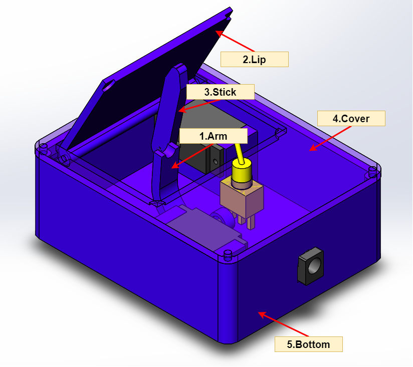
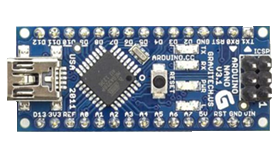
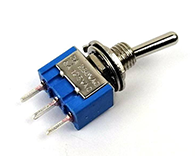
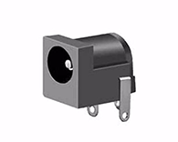
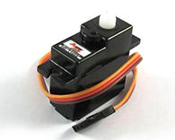
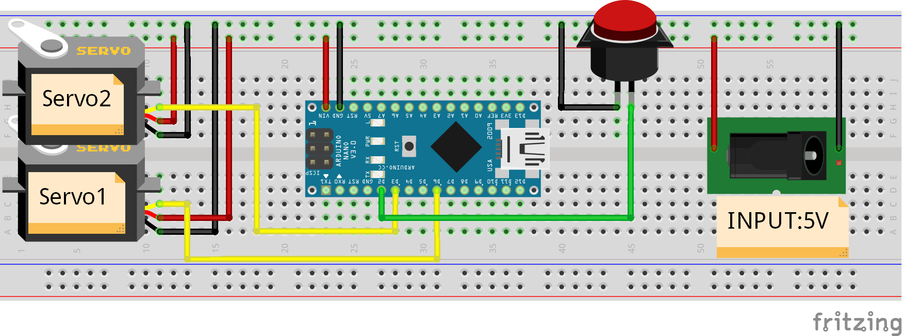
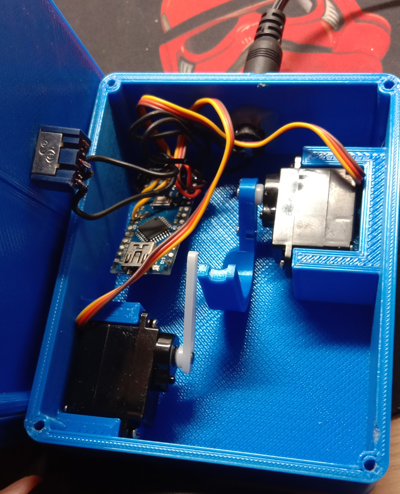

# Useless Box

## 1. Parts needed

### 1.1 3D Printing

There are some parts you need to 3D print yourself, 5 of them totally. You can find them in `3D-File/Stl` folder. You can also modify these parts using `solidworks` in `3D-File/Parts` folder.

### 1.2 Electronic Parts

In this project, I use `Arduino Uno` as my controller, and you may also need some other parts as BOM table showing below. You can replace some of them if you are familiar with arduino projects.

| Electronics          | quantity |                   Image                    |
| :------------------- | :------: | :----------------------------------------: |
| Arduino Uno          |    1     |      |
| Toggle Swtich        |    1     |  |
| DC-005 Power Socket  |    1     |                  |
| HD-1160A Servo Motor |    2     |      |

## 2. Assemble

First you need to wire your electronics referring to below diagram.

> Note that you must apply **5V power** to the circuit if you are wiring like my diagram.

Then assemble 3D printing parts and wired electronics together.

You can just use the longer servo stick instead of using 3D printing **stick** part like me.

Finally, upload arduino code to your board and have fun!

## 3. Presentation

https://user-images.githubusercontent.com/75357598/142750349-8485f8f9-0854-4409-b59b-4909fe04149b.mp4
